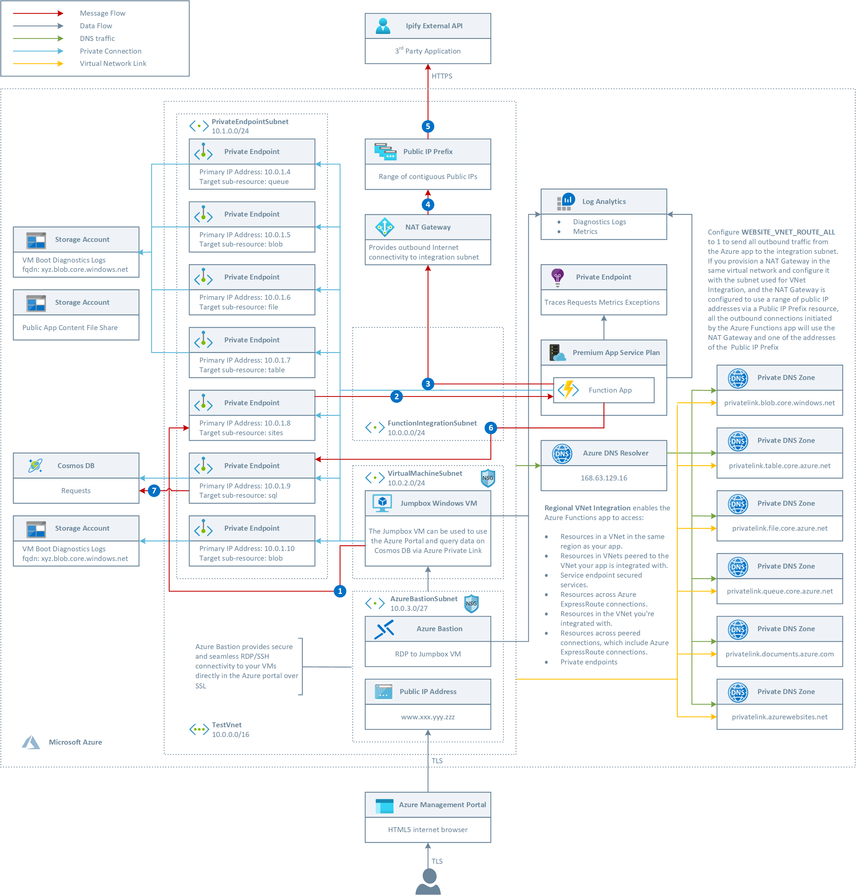
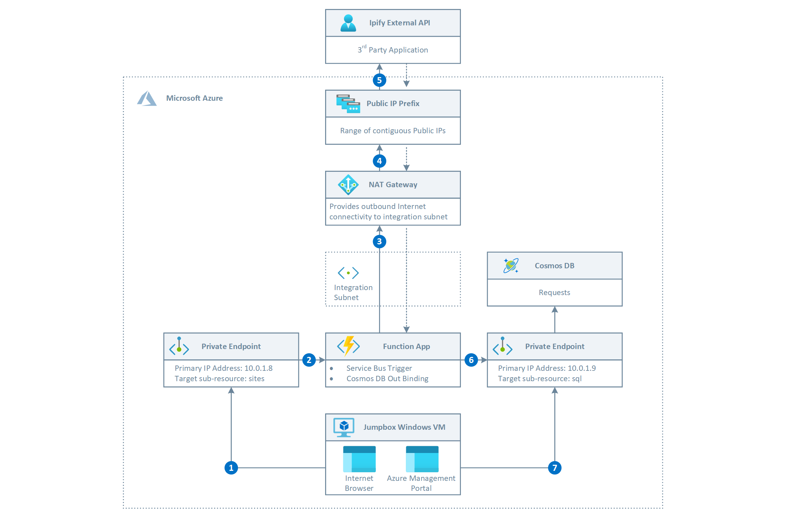
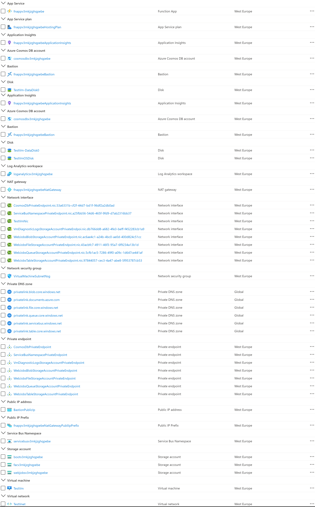
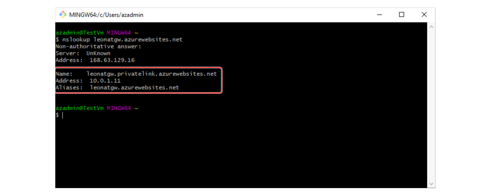
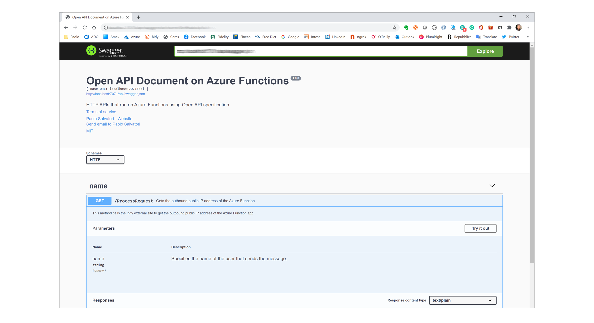

# Call an HTTP Azure Function using a Private Endpoint


This sample shows how to call an [HTTP-triggered Azure Function](https://docs.microsoft.com/en-us/azure/azure-functions/functions-bindings-http-webhook-trigger?tabs=csharp) using [Azure Private Endpoints](https://docs.microsoft.com/azure/private-link/private-endpoint-overview). The Azure Functions app is hosted in [Azure Functions Premium Plan](https://docs.microsoft.com/en-us/azure/azure-functions/functions-premium-plan?tabs=portal) with [Regional VNET Integration](https://docs.microsoft.com/en-us/azure/app-service/web-sites-integrate-with-vnet#regional-vnet-integration). In addition, the sample demonstrates how to use the [Azure NAT Gateway](https://docs.microsoft.com/en-us/azure/virtual-network/nat-gateway-resource) to handle outbound connections from the Azure Functions app when this makes a large number of calls to external services. 

For more information on how to use Azure Private Endpoints to let Azure Web App and HTTP-triggered Azure Functions be called via a private IP address by applications located in a virtual network, see:

- [Using Private Endpoints for Azure Web App](https://docs.microsoft.com/en-us/azure/app-service/networking/private-endpoint).
- [Create an App Service app and deploy a private endpoint by using an Azure Resource Manager template](https://docs.microsoft.com/en-us/azure/app-service/scripts/template-deploy-private-endpoint).

For a similar sample with a non-HTTP-triggered Azure Function, see [Azure Functions, Private Endpoints, and NAT Gateway](https://github.com/paolosalvatori/azure-function-premium-plan). 

## Deploy to Azure

You can use the following button to deploy the demo to your Azure subscription:

[](https://portal.azure.com/#create/Microsoft.Template/uri/https%3A%2F%2Fraw.githubusercontent.com%2FAzure-Samples%2FAzure-Functions-Private-Endpoints%2Fmaster%2Ftemplate%2Fazuredeploy.json%3Ftoken%3DAAIW4AOWATWNQLL2JZKDBAK63EOOU)

## Architecture

The following picture shows the architecture and network topology of the sample.



The ARM template deploys the following resources to the target resource group:

- Virtual Network: this virtual network is composed of the following subnets:
  - **FunctionSubnet**: this subnet is used for the regional VNET integration with the Azure Function app hosted by a Premium Plan. For more information, see [Tutorial: integrate Functions with an Azure virtual network](https://docs.microsoft.com/en-us/azure/azure-functions/functions-create-vnet)
  - **PrivateEndpointSubnet**: hosts the private endpoints used by the application.
  - **VirtualMachineSubnet**: hosts the Jumpbox virtual machine and any additional virtual machine used by the solution.
  - **AzureBastionSubnet**: hosts Azure Bastion. For more information, see [Working with NSG access and Azure Bastion](https://docs.microsoft.com/en-us/azure/bastion/bastion-nsg).
- Network Security Group: this resource contains an inbound rule to allow access to the jumpbox virtual machine on port 3389 (RDP)
- A Windows 10 virtual machine. This virtual machine can be used as jumpbox virtual machine to simulate a real application and send requests to the Azure Functions exposed via [Azure Private Link](https://docs.microsoft.com/en-us/azure/private-link/private-link-overview).
- A Public IP for Azure Bastion
- Azure Bastion is used to access the jumpbox virtual machine from the Azure Portal via RDP. For more information, see [What is Azure Bastion?](https://docs.microsoft.com/en-us/azure/bastion/bastion-overview).
- An ADLS Gen 2 storage account used to store the boot diagnostics logs of the virtual machine as blobs
- An ADLS Gen 2 storage account used by Azure Functions for key management, timer trigger management, and Event Hubs checkpoints. The storage account must be a general-purpose one that supports blobs, queues, and tables. For more information, see [AzureWebJobsStorage](https://docs.microsoft.com/it-it/azure/azure-functions/functions-app-settings#azurewebjobsstorage).
- An ADLS Gen 2 storage account where the function app code and configuration are stored in event-driven scaling plans running on Windows. For more information, see [WEBSITE_CONTENTAZUREFILECONNECTIONSTRING](https://docs.microsoft.com/it-it/azure/azure-functions/functions-app-settings#website_contentazurefileconnectionstring).
- An Azure Function Premium Plan hosting the Azure Function app. For more information, see [Azure Functions Premium Plan](https://docs.microsoft.com/en-us/azure/azure-functions/functions-premium-plan?tabs=portal).
- An Azure Functions app containing a single function that:
  - Receives requests via [Azure Functions HTTP Trigger](https://docs.microsoft.com/en-us/azure/azure-functions/functions-bindings-http-webhook-trigger).
  - Invokes the [ipify](https://api.ipify.org) external service via the NAT gateway to retrieve its public IP.
  - Stores the original message enriched with the public IP address retrieved from ipify to a Cosmos DB database.
- An Application Insights resource used by the Azure Functions app to store logs, traces, requests, exceptions, and metrics. For more information, see [Monitor Azure Functions](https://docs.microsoft.com/en-us/azure/azure-functions/functions-monitoring).
- An Azure Cosmos used to store enriched messages. DB For more information, see [Welcome to Azure Cosmos DB](https://docs.microsoft.com/en-us/azure/cosmos-db/introduction).
- A private endpoint to all the storage accounts, Azure Functions app, and Cosmos DB account.
- A Private DNS Zone Group to link each private endpoint with the corresponding Private DNS Zone.
- The NIC used by the jumpbox virtual machine and for each private endpoint to storage accounts, Azure Functions app, or Cosmos DB account.
- A NAT Gateway used by the Azure Functions app for the outbound connections from the integration subnet. For more information, see [Designing virtual networks with NAT gateway resources](https://docs.microsoft.com/en-us/azure/virtual-network/nat-gateway-resource).
- A Public IP Address Prefix provideing a contiguous range of public IP addresses to the NAT Gateway. For more information, see [Public IP address prefix](https://docs.microsoft.com/en-us/azure/virtual-network/public-ip-address-prefix) and [Designing virtual networks with NAT gateway resources](https://docs.microsoft.com/en-us/azure/virtual-network/nat-gateway-resource).
- A Log Analytics workspace used to monitor the health status of the services such as the hosting plan or NSG.
- A Private DNS Zone for File Storage Account private endpoints (privatelink.file.core.windows.net)
- A Private DNS Zone for Blob Storage Account private endpoints (privatelink.blob.core.windows.net)
- A Private DNS Zone for Queue Storage Account private endpoints (privatelink.queue.core.windows.net)
- A Private DNS Zone for Table Storage Account private endpoints (privatelink.table.core.windows.net)
- A Private DNS Zone for Web Apps and HTTP-Triggered Azure Functions private endpoints (privatelink.azurewebsites.net)
- A Private DNS Zone for Cosmos DB private endpoints (privatelink.documents.windows.net)

Here are some facts you need to consider when accessing a Web App or HTTP-triggered AZure Function via a Private Endpoint:

- When you enable Private Endpoints to your Web App or HTTP-triggered Azure Function, you disable all public access.
 -The IP address of the Private Endpoint NIC must be dynamic, but will remain the same until you delete the Private Endpoint.
 -The NIC of the Private Endpoint cannot have a Network Security Group (NSG) associated.
 -The subnet that hosts the Private Endpoint can have an NSG associated, but you must disable the network policies enforcement for the Private Endpoint: see Disable network policies for private endpoints. As a result, you cannot filter by any NSG the access to your Private Endpoint.
- When you enable a Private Endpoint to your Web App or HTTP-triggered Azure Function, the Access Restrictions configuration of the Web App or HTTP-triggered Azure Function is not evaluated.
- You can eliminate the data exfiltration risk from the virtual network by removing all NSG rules where the destination is tag Internet or Azure services. When you deploy a Private Endpoint for a Web App or HTTP-triggered Azure Function, you can only reach this specific Web App or HTTP-triggered Azure Function through the Private Endpoint.
- Each Azure Function app has an Advanced Tool (Kudu) site that is used to manage function app deployments. This site is accessed from a URL like: <FUNCTION_APP_NAME>.scm.azurewebsites.net. Enabling access restrictions on the Kudu site prevents the deployment of the project code from a local developer workstation, and then an agent is needed within the virtual network to perform the deployment.

## Message Flow

The following diagram shows the message flow of the demo:



1. You can use [curl](https://curl.se/), [Postman](https://www.postman.com/), [Apache JMeter](https://jmeter.apache.org/), or simply your favorite internet browser from the jumpbox virtual machine located to send requests to the HTTP-triggered function at https://<functions-app-name>.azurewebsites.net/api/processrequest?name=<your-name>. **Important Note**: When you enable Private Endpoints to your Web App or HTTP-triggered Azure Function, you disable all public access to it. If you just need a secure connection between your virtual network and your Web App or HTTP-triggered Azure Function, a Service Endpoint is the simplest solution. But, if you also need to reach the Web App or HTTP-triggered Azure Function from on-premises through an Azure Gateway, a regionally peered virtual network, or a globally peered virtual network, Private Endpoint is the solution.
2. The request is received by the Azure Function via the private endpoint using the [Azure Functions HTTP Trigger](https://docs.microsoft.com/en-us/azure/azure-functions/functions-bindings-http-webhook-trigger).
3. The Function invokes the [ipify](https://api.ipify.org) external service to retrieve its public IP address. The WEBSITE_VNET_ROUTE_ALL setting of the Azure Functions app is set to 1, hence all of the outbound traffic from the Azure Functions is routed through the integration subnet. If you route all of the outbound calls from the Azure Functions app into the integration VNet, the traffic will be subject to the NSGs and UDRs that are applied to the integration subnet. For more information, see [Regional virtual network integration](https://docs.microsoft.com/en-us/azure/azure-functions/functions-networking-options#regional-virtual-network-integration). When you route all of the outbound traffic from the Azure Functions app into the integration VNet, and the subnet is not configured to use a NAT gateway, the outbound addresses are still the outbound addresses that are listed in your app properties unless you provide routes to send the traffic elsewhere. In this case, you need to pay attention to avoid SNAT ports exhaustion issue. For more information, see [SNAT with App Service](https://4lowtherabbit.github.io/blogs/2019/10/SNAT/) and [Manage connections in Azure Functions](https://docs.microsoft.com/en-us/azure/azure-functions/manage-connections).
4. The integration subnet is configured to use a NAT Gateway for outbound connections, hence all the calls from the Azure Functions app to any external service go through the NAT Gateway. The NAT Gateway solves another problem beyond providing a dedicated internet address. You can also now have 64k outbound SNAT ports usable by your apps. One of the challenges in the App Service is the limit on the number of connections you can have to the same address and port. There are more details on this problem in the [Troubleshooting intermittent outbound connection errors guide](https://docs.microsoft.com/azure/app-service/troubleshoot-intermittent-outbound-connection-errors). To use a NAT Gateway with your app, you need to

   - Configure Regional Vnet Integration with your app as described in Integrate your app with an Azure virtual network
   - Route all the outbound traffic into your Azure virtual network
   - Provision a NAT Gateway in the same virtual network and configure it with the subnet used for VNet Integration. For more information on this topology, see [NAT Gateway and app integration](https://azure.github.io/AppService/2020/11/15/web-app-nat-gateway.html)
5. If a public IP prefix resource is used with a NA Gateway, all the IP addresses of the Public IP Prefix resource are consumed by a NAT gateway resource. In our sample, every outbound call via HTTPS from the Azure Function to the [ipify](https://api.ipify.org) external service will use one of the public IP addresses of the prefix.
6. The Azure Function stores the response message sent back to the caller enriched with the public IP address received from the [ipify](https://api.ipify.org) external service to the Cosmos DB database via a private endpoint.
7. You can use the Azure Portal from the jumpbox virtual machine to query data in the Cosmos DB database using Data Explorer. For more information, see [Work with data using Azure Cosmos DB Explorer](https://docs.microsoft.com/en-us/azure/cosmos-db/data-explorer). As an alternative, you can create an IP Firewall rule to allow access from your local computer and run queries from it. For more information, see [Configure IP firewall in Azure Cosmos DB](https://docs.microsoft.com/en-us/azure/cosmos-db/how-to-configure-firewall)

## Prerequisites

The following components are required to run this sample:

- [.NET Core 3.1](https://dotnet.microsoft.com/download/dotnet-core/3.1)
- [Visual Studio Code](https://code.visualstudio.com/)
- [Azure CLI](https://docs.microsoft.com/cli/azure/install-azure-cli?view=azure-cli-latest)
- [Azure Functions Core Tools](https://docs.microsoft.com/azure/azure-functions/functions-run-local)
- [Azure subscription](https://azure.microsoft.com/free/)

### Options

You can use the [Azure Cosmos DB Emulator](https://docs.microsoft.com/azure/cosmos-db/local-emulator) and [Azure Storage Emulator](https://docs.microsoft.com/azure/storage/common/storage-use-emulator), along with the Azure Functions Core Tools, if you wish to develop and test locally.

### Deployment

You can use the ARM template and Bash script included in the sample to deploy to Azure the entire infrastructure necessary to host the demo:

```sh
#!/bin/bash

# Variables
resourceGroupName="<your-resource-group-name>"
location="<your-favorite-location>"
deploy=1

# ARM template and parameters files
template="../templates/azuredeploy.json"
parameters="../templates/azuredeploy.parameters.json"

# SubscriptionId of the current subscription
subscriptionId=$(az account show --query id --output tsv)
subscriptionName=$(az account show --query name --output tsv)

# Check if the resource group already exists
createResourceGroup() {
    local resourceGroupName=$1
    local location=$2

    # Parameters validation
    if [[ -z $resourceGroupName ]]; then
        echo "The resource group name parameter cannot be null"
        exit
    fi

    if [[ -z $location ]]; then
        echo "The location parameter cannot be null"
        exit
    fi

    echo "Checking if [$resourceGroupName] resource group actually exists..."

    if ! az group show --name "$resourceGroupName" &>/dev/null; then
        echo "No [$resourceGroupName] resource group actually exists"
        echo "Creating [$resourceGroupName] resource group..."

        # Create the resource group
        if az group create --name "$resourceGroupName" --location "$location" 1>/dev/null; then
            echo "[$resourceGroupName] resource group successfully created"
        else
            echo "Failed to create [$resourceGroupName] resource group"
            exit
        fi
    else
        echo "[$resourceGroupName] resource group already exists"
    fi
}

# Validate the ARM template
validateTemplate() {
    local resourceGroupName=$1
    local template=$2
    local parameters=$3
    local arguments=$4

    # Parameters validation
    if [[ -z $resourceGroupName ]]; then
        echo "The resource group name parameter cannot be null"
    fi

    if [[ -z $template ]]; then
        echo "The template parameter cannot be null"
    fi

    if [[ -z $parameters ]]; then
        echo "The parameters parameter cannot be null"
    fi

    echo "Validating [$template] ARM template..."

    if [[ -z $arguments ]]; then
        error=$(az deployment group validate \
            --resource-group "$resourceGroupName" \
            --template-file "$template" \
            --parameters "$parameters" \
            --query error \
            --output json)
    else
        error=$(az deployment group validate \
            --resource-group "$resourceGroupName" \
            --template-file "$template" \
            --parameters "$parameters" \
            --arguments $arguments \
            --query error \
            --output json)
    fi

    if [[ -z $error ]]; then
        echo "[$template] ARM template successfully validated"
    else
        echo "Failed to validate the [$template] ARM template"
        echo "$error"
        exit 1
    fi
}

# Deploy ARM template
deployTemplate() {
    local resourceGroupName=$1
    local template=$2
    local parameters=$3
    local arguments=$4

    # Parameters validation
    if [[ -z $resourceGroupName ]]; then
        echo "The resource group name parameter cannot be null"
        exit
    fi

    if [[ -z $template ]]; then
        echo "The template parameter cannot be null"
        exit
    fi

    if [[ -z $parameters ]]; then
        echo "The parameters parameter cannot be null"
        exit
    fi

    if [ $deploy != 1 ]; then
        return
    fi

    # Deploy the ARM template
    echo "Deploying [$template$] ARM template..."

    if [[ -z $arguments ]]; then
         az deployment group create \
            --resource-group $resourceGroupName \
            --template-file $template \
            --parameters $parameters 1>/dev/null
    else
         az deployment group create \
            --resource-group $resourceGroupName \
            --template-file $template \
            --parameters $parameters \
            --parameters $arguments 1>/dev/null
    fi

    if [[ $? == 0 ]]; then
        echo "[$template$] ARM template successfully provisioned"
    else
        echo "Failed to provision the [$template$] ARM template"
        exit -1
    fi
}

# Create Resource Group
createResourceGroup \
    "$resourceGroupName" \
     "$location"

# Validate ARM Template
validateTemplate \
    "$resourceGroupName" \
    "$template" \
    "$parameters"

# Deploy ARM Template
deployTemplate \
    "$resourceGroupName" \
    "$template" \
    "$parameters"
```

The following figure shows the Azure resources grouped by type deployed by the ARM template in the target resource group.



### Deploy the Azure Function code

Once the Azure resources have been deployed to Azure (which can take about 10-12 minutes), you need to deploy the Azure Function contained in the src folder to the newly created Azure Function app. Each Azure Function app has an Advanced Tool (Kudu) site that is used to manage function app deployments. This site is accessed from a URL like: <FUNCTION_APP_NAME>.scm.azurewebsites.net. Enabling a Private Endpoint for an HTTP-Triggered Azure Function disables the public access to its public endpoint and scm endpoint. This prevents the deployment of the project code from a local developer workstation, and then an agent is needed within the virtual network to perform the deployment. For demo purposes, can install and use [Visual Studio Code](https://code.visualstudio.com/) or [Visual Studio](https://visualstudio.microsoft.com/) on the jumpbox virtual machine to deploy the application to the Azure Functions app as the virtual machine has access to the <FUNCTION_APP_NAME>.scm.azurewebsites.net endpoint via the private endpoint deployed by the ARM template. For more information, see [Develop Azure Functions using Visual Studio](https://docs.microsoft.com/en-us/azure/azure-functions/functions-develop-vs). As an alternative, you can use the [Azure Functions Core Tools](https://docs.microsoft.com/azure/azure-functions/functions-run-local?tabs=windows%2Ccsharp%2Cbash#publish) to deploy the application, as shown in the code snippet below:

```azurecli
func azure functionapp publish [YOUR-FUNCTION-APP-NAME]
```

To deploy Azure Functions app to a real-world testing or production environment, you should use [Azure DevOps](https://docs.microsoft.com/en-us/azure/devops/pipelines/targets/azure-functions-windows?view=azure-devops&tabs=dotnet-core%2Cyaml) with a self-hosted agent in the same virtual network. Likewise, you can use [GitHub Actions](https://docs.microsoft.com/en-us/azure/azure-functions/functions-how-to-github-actions?tabs=dotnet) with a [self-hosted runner](https://docs.github.com/en/actions/hosting-your-own-runners/about-self-hosted-runners) deployed to the same virtual network.

Below you can read the code of the Azure Function. The code of the Azure Function makes use of the dependency injection (DI) software design pattern, which is a technique to achieve [Inversion of Control (IoC)](https://docs.microsoft.com/en-us/dotnet/standard/modern-web-apps-azure-architecture/architectural-principles#dependency-inversion) between classes and their dependencies.

- Dependency injection in Azure Functions is built on the .NET Core Dependency Injection features. Familiarity with [.NET Core dependency injection](https://docs.microsoft.com/en-us/aspnet/core/fundamentals/dependency-injection) is recommended. There are differences in how you override dependencies and how configuration values are read with Azure Functions on the Consumption plan.
- Support for dependency injection begins with Azure Functions 2.x.

For more information, see [Use dependency injection in .NET Azure Functions](https://docs.microsoft.com/en-us/azure/azure-functions/functions-dotnet-dependency-injection#register-services).

In addition, the code makes use of [Azure Functions Open API Extension](https://github.com/Azure/azure-functions-openapi-extension) to enable Open API extension on the HTTP-triggered Azure Function and render Swagger UI that you can use to send requests to the function or review its Open API schema.

```csharp
using System;
using System.Linq;
using System.Net;
using System.Net.Http;
using System.Threading.Tasks;
using Microsoft.OpenApi.Models;
using Microsoft.AspNetCore.Mvc;
using Microsoft.AspNetCore.Http;
using Microsoft.Extensions.Logging;
using Microsoft.Azure.WebJobs;
using Microsoft.Azure.WebJobs.Extensions.Http;
using Microsoft.Azure.WebJobs.Extensions.OpenApi.Core.Attributes;
using Microsoft.Azure.WebJobs.Extensions.OpenApi.Core.Enums;

namespace Microsoft.Azure.Samples
{
    public class RequestReceiver
    {
        private const string IpifyUrl = "https://api.ipify.org";
        private const string Unknown = "UNKNOWN";
        private const string Dude = "dude";
        private const string NameParameter = "name";

        private readonly HttpClient httpClient;

        public RequestReceiver(HttpClient httpClient)
        {
            this.httpClient = httpClient;
        }

        [OpenApiOperation(operationId: "GetPublicIpAddress", 
                          tags: new[] { "name" }, 
                          Summary = "Gets the outbound public IP address", 
                          Description = "Gets the outbound public IP address", 
                          Visibility = OpenApiVisibilityType.Important)]
        [OpenApiParameter(name: "name", 
                          In = ParameterLocation.Query, 
                          Required = false, 
                          Type = typeof(string), 
                          Summary = "The name of the user that sends the message.", 
                          Description = "The name", 
                          Visibility = OpenApiVisibilityType.Important)]
        [OpenApiResponseWithBody(statusCode: HttpStatusCode.OK, 
                                 contentType: "text/plain", 
                                 bodyType: typeof(string), 
                                 Summary = "The response", 
                                 Description = "This returns the response")]
        [FunctionName("ProcessRequest")]
        public async Task<IActionResult> Run([HttpTrigger(AuthorizationLevel.Anonymous, 
                                             "get", Route = null)] HttpRequest request,
                                             [CosmosDB(databaseName: "%CosmosDbName%", 
                                             collectionName:"%CosmosDbCollectionName%", 
                                             ConnectionStringSetting = "CosmosDBConnection")] 
                                             IAsyncCollector<Request> items,
                                             ILogger log,
                                             ExecutionContext executionContext)
        {
            try
            {
                // Read the name parameter
                var name = request.Query[NameParameter].FirstOrDefault() ?? Dude;

                // Log message
                log.LogInformation($"Started '{executionContext.FunctionName}' " +
                                   $"(Running, Id={executionContext.InvocationId}) " +
                                   $"A request has been received from {name}");

                // Retrieve the public IP from Ipify site
                var publicIpAddress = Unknown;
                try
                {
                    var response = await httpClient.GetAsync(IpifyUrl);

                    if (response.IsSuccessStatusCode)
                    {
                        publicIpAddress = await response.Content.ReadAsStringAsync();

                        // Log message
                        log.LogInformation($"Running '{executionContext.FunctionName}' " +
                                           $"(Running, Id={executionContext.InvocationId}) " +
                                           $"Call to {IpifyUrl} returned {publicIpAddress}");
                    }
                }
                catch (Exception ex)
                {
                    log.LogError(ex, $"Error '{executionContext.FunctionName}' " +
                                     $"(Running, Id={executionContext.InvocationId}) " +
                                     $"An error occurred while calling {IpifyUrl}: {ex.Message}");
                }

                // Create response message
                var responseMessage = $"Hi {name}, the HTTP triggered function invoked " +
                                      $"the external site using the {publicIpAddress} public IP address.";

                // Initialize message
                var customMessage = new Request
                {
                    Id = executionContext.InvocationId.ToString(),
                    PublicIpAddress = publicIpAddress,
                    ResponseMessage = responseMessage,
                    RequestHeaders = request.Headers
                };

                // Store the message to Cosmos DB
                await items.AddAsync(customMessage);
                log.LogInformation($"Completed '{executionContext.FunctionName}' " +
                                   $"(Running, Id={executionContext.InvocationId}) "+
                                   $"The response has been successfully stored to Cosmos DB");
                // Return 
                return new OkObjectResult(responseMessage);
            }
            catch (Exception ex)
            {
                log.LogError(ex, $"Failed '{executionContext.FunctionName}' " +
                                 $"(Running, Id={executionContext.InvocationId}) {ex.Message}");
                return new BadRequestObjectResult("An error occurred while processing the request.");
                throw;
            }
        }
    }
}
```

As an alternative, you can use a static, singleton instance of the HttpClient object to call the external ipify service via HTTPS. To avoid holding more connections than necessary, we suggest reusing client instances rather than creating new ones with each function invocation. We recommend reusing client connections for any language that you might write your function in. For example, .NET clients like the HttpClient, DocumentClient, and Azure Storage clients can manage connections if you use a single, static client. For more information, see [https://docs.microsoft.com/en-us/azure/azure-functions/manage-connections#static-clients](https://docs.microsoft.com/en-us/azure/azure-functions/manage-connections#client-code-examples).

**Note**: when debugging the Azure Function locally, make sure to replace the placeholders in the `local.settings.json` file with a valid connection string for the storage account, Service Bus namespace, and Cosmos DB account.

## Run the sample

You can proceed as follows to run the sample:

- Connect to the jumpbox virtual machine via Azure Bastion
- Open a Windows or Bash command-prompt and run the `nslookup` command passing byt the FQDN of the Azure Functions app as a parameter:

  ```sh
  nslookup funcapp.azurewebsites.net
  ```

  The command should return a result as follows:

  

  When you deploy a Private Endpoint for the HTTP-triggered Azure Function, Azure updates the DNS entry to point to the canonical name `funcapp.privatelink.azurewebsites.net`.

  | Name                                  | Type  |  Value                                | Remarks                                  |
  |:--------------------------------------|:------|:--------------------------------------|:-----------------------------------------|
  | funcapp.azurewebsites.net             | CNAME | funcapp.privatelink.azurewebsites.net | Azure creates this entry in Azure Public DNS to point the app service to the privatelink |
  | funcapp.privatelink.azurewebsites.net | A     | Private Endpoint IP                   | You manage this entry in your DNS system to point to your Private Endpoint IP address     |

  After this DNS configuration you can reach your Web App privately with the default name `funcapp.azurewebsites.net`. You must use this name, because the default certificate is issued for `*.azurewebsites.net`.

  For the Kudu console, or Kudu REST API (deployment with Azure DevOps self-hosted agents for example), you must create two records in your Azure DNS private zone or your custom DNS server. This is done by the ARM template in this sample.

  | Name                                      | Type | Value               |
  |:------------------------------------------|:-----|:--------------------|
  | funcapp.privatelink.azurewebsites.net     |  A   | Private Endpoint IP |
  | funcapp.scm.privatelink.azurewebsites.net |  A   | Private Endpoint IP |

- You can use [curl](https://curl.se/), [Postman](https://www.postman.com/), [Apache JMeter](https://jmeter.apache.org/) or simply your favorite internet browser from the jumpbox virtual machine located to send requests to the HTTP-triggered function at https://<functions-app-name>.azurewebsites.net/api/processrequest?name=<your-name>. The Azure Functions app expose additional functions for Open API support. In particular, you can use the Swagger UI shown in the following picture to call the HTTP-triggered function:

- If you use [curl](https://curl.se/), [Postman](https://www.postman.com/), or [Apache JMeter](https://jmeter.apache.org/), you can simulate a traffic burst by sending hundreds of calls in a few seconds.
- You can run the following query in Data Explorer to retrieve the list of public IP addresses used by the Azure Functions app to invoke the [ipify](https://api.ipify.org) external service. You will notice that they all belong to the Public IP Address Prefix resource used by the NAT Gateway.

```sql
SELECT DISTINCT VALUE r.publicIpAddress FROM Requests r
```

In case of failure of the call to the external service, the Azure Functions app sets the value of the public IP address to `UNKNOWN`. As you can see below, none of the calls to the external service returned an error, all of them used one of the 16 public IP addresses provided by the NAT Gateway and Public IP Address Prefix.

```json
[
    "20.61.15.136",
    "20.61.15.140",
    "20.61.15.141",
    "20.61.15.133",
    "20.61.15.131",
    "20.61.15.143",
    "20.61.15.134",
    "20.61.15.129",
    "20.61.15.142",
    "20.61.15.135",
    "20.61.15.139",
    "20.61.15.130",
    "20.61.15.132",
    "20.61.15.138",
    "20.61.15.128",
    "20.61.15.137"
]
```

Below you can see the public IP address range in CIDR notation of the Public IP Address Prefix resource used by the NAT Gateway.


The Public IP Address Prefix includes 16 public IP addresses that go from `20.61.15.128` to `20.61.15.143`. For more information, see [CIDR Notation](https://en.wikipedia.org/wiki/Classless_Inter-Domain_Routing#:~:text=CIDR%20notation%20is%20a%20compact,bits%20in%20the%20network%20mask.).

You can also use the following query to retrieve how many outbound calls were made with each public IP address provided by the Public IP Address Prefix:

```sql
SELECT r.publicIpAddress,  COUNT(r.publicIpAddress) FROM Requests r GROUP BY r.publicIpAddress
```

The query should return something like this:

```json
[
    {
        "publicIpAddress": "20.61.15.137",
        "$1": 100
    },
    {
        "publicIpAddress": "20.61.15.128",
        "$1": 100
    },
    {
        "publicIpAddress": "20.61.15.138",
        "$1": 100
    },
    {
        "publicIpAddress": "20.61.15.132",
        "$1": 200
    },
    {
        "publicIpAddress": "20.61.15.130",
        "$1": 231
    },
    {
        "publicIpAddress": "20.61.15.139",
        "$1": 100
    },
    {
        "publicIpAddress": "20.61.15.135",
        "$1": 123
    },
    {
        "publicIpAddress": "20.61.15.142",
        "$1": 100
    },
    {
        "publicIpAddress": "20.61.15.129",
        "$1": 100
    },
    {
        "publicIpAddress": "20.61.15.134",
        "$1": 100
    },
    {
        "publicIpAddress": "20.61.15.143",
        "$1": 87
    },
    {
        "publicIpAddress": "20.61.15.131",
        "$1": 379
    },
    {
        "publicIpAddress": "20.61.15.133",
        "$1": 187
    },
    {
        "publicIpAddress": "20.61.15.141",
        "$1": 373
    },
    {
        "publicIpAddress": "20.61.15.140",
        "$1": 299
    },
    {
        "publicIpAddress": "20.61.15.136",
        "$1": 100
    }
]
```
